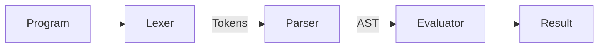
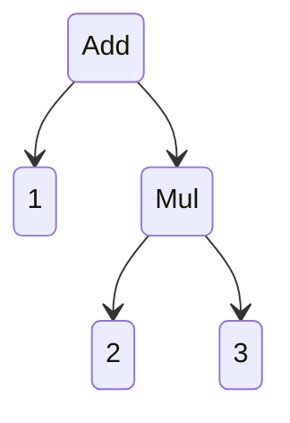
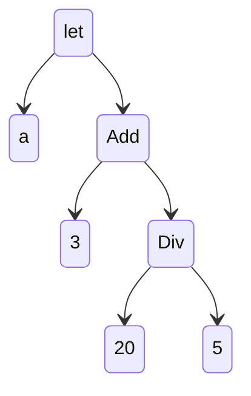
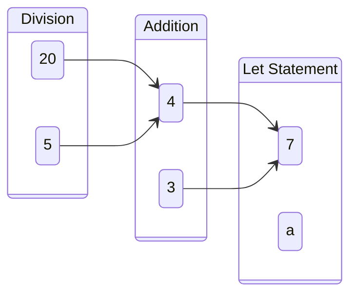

<div class="flex flex-col items-center justify-center h-full w-full"> 

<h1 class="font-extrabold text-transparent bg-clip-text bg-gradient-to-r from-purple-400 to-pink-600">
    Welcome to the workshop! 
</h1>


</div>

<!-- ============================================================================================ -->
---
theme: default
class: text-center
title: Agenda
---
<div class="flex flex-col justify-center items-center h-full w-full">
<h2 class="font-extrabold text-transparent bg-clip-text bg-gradient-to-r from-purple-400 to-pink-600">
 Sooooo what exactly are we gonna do today?
</h2>
<br/>

**The basics of Interpreters**  
<span class="text-gray-400/50 flex flex-row items-center"> 
Lexers, AST, Pratt Parsing etc.

</span>
 

**Making our own programming language** <br/>
<span class="text-gray-400/50 flex flex-row items-center">
Make a simple programming language with syntax similar to javascript

</span>

<div class="h-auto w-full items-center flex justify-center">
</div>
</div>

<!-- ============================================================================================ -->
---

<div  class="flex flex-col h-full w-full justify-center items-center">
<h1 class="font-extrabold text-transparent bg-clip-text bg-gradient-to-r from-purple-400 to-pink-600">
    What are `Interpreters`?
</h1>

</div>

<!-- ============================================================================================ -->
---

<div class="flex flex-col items-center  w-full h-full">

<h1 class="font-extrabold text-transparent bg-clip-text bg-gradient-to-r from-purple-400 to-pink-600">
    Interpreters 
</h1>

An Interpreter is a computer program that directly executes instructions written in a programming or scripting language, without requiring them previously to have been compiled into a machine language program




</div>

<!-- ============================================================================================ -->
---

<h1 class="font-extrabold text-transparent bg-clip-text bg-gradient-to-r from-purple-400 to-pink-600">
    Lexer 
</h1>

Program  to  Tokens

Tokens are the "type of symbols" used in a program.

Program:
```js
let a = 3+7;
```

- special token: `let` 
- identifier: `a`
- symbol: `equals`
- integer literal: `3`
- symbol: `plus`
- integer literal: `7`
- symbol: `semicolon`

**Final tokenized result:** `let ident:a equals 3 plus 7 semicolon`

<!-- ============================================================================================ -->
---

<h1 class="font-extrabold text-transparent bg-clip-text bg-gradient-to-r from-purple-400 to-pink-600">
   Parser 
</h1>

Tokens to AST

AST stands Abstract Syntax Tree. It is basically a tree of tokens arranged in order of their operation.

`1 + 2 * 3`

Tokenized: `1 plus 2 asterisk 3`


---

`let` statement AST: `let a = 3+20/5`


<!-- ============================================================================================ -->
---

<h1 class="font-extrabold text-transparent bg-clip-text bg-gradient-to-r from-purple-400 to-pink-600">
   Evaluator 
</h1>

Loops around every node in the AST and evaluates it.

`let a = 3+20/5`



---

<div class="flex flex-col items-center justify-center h-full w-full"> 

<h1 class="font-extrabold text-transparent bg-clip-text bg-gradient-to-r from-purple-400 to-pink-600 flex flex-row">
    Let's start hacking!
    <!--  -->
</h1>


</div>

